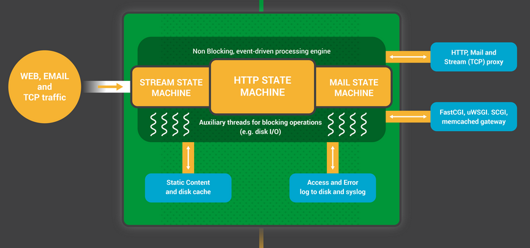

NGINX Basic configurations and guides
=====================================

What is covered? Proper configuration directory structure for nginx, the different blocks.


What will I learn here? How to setup SSL servers and how to setup websockets.


## Directory structure

As advised throughout the guide we assume you are using fedora linux or debian.


In that case after installing nginx you should find the directory `/etc/nginx` this is, as per unix conventions, where configurations for nginx resids.


Keep in mind that whenever you change nginx configuration you will need to restart the server for these configurations to take effect.


How to restart server?


`systemctl restart nginx`


follow that command with `systemctl status nginx` This will report if it started succesfully. If one of your configuration files is malformed this will be reported [check this document for information on how to read logs](generic/journalctl.md).


### Configuration files

There is one main configuration files, this is located in `/etc/nginx/nginx.conf`


Here is an example of one

```
user nginx;
worker_processes 2;
error_log /var/log/nginx/error.log;
pid /run/nginx.pid;

events {
        worker_connections 1024;
        use epoll;
}

http {
}

```

This file doesn't have much, the first line defines the user underwhich the nginx process is to run, the second is the amount of workers to use `worker_processes`


It's definition from the nginx documentation


> Defines the number of worker processes.
>
>The optimal value depends on many factors including (but not limited to) the number of
> CPU cores, the number of hard disk drives that store data, and load pattern.
> When one is in doubt, setting it to the number of available CPU cores would be a good start (the value “auto” will try to autodetect it)


So it can either take an integer value, or auto. If you are unsure how to best use your CPU and of it's cores and weather they are virtual (hyperthreaded) hardware threads or not simply use auto, or 2 as a minimum *if* you know you have more than 2 hardware threads are available, again use auto i you don't know that that means.


The second is simply the `error_log`, I advice against changing it why? Well if you do you need to make sure that nginx has correct permissions to read and write to that log.


The third line defines the pid file, needs same permissions as error log [read this](generic/pid_file.md) to find out what a pid file is.


Now let's talk about the events block, before we do what is a block? 


well nginx configuration is made out of directives. Some directives are simple one liners like `user` and `worker_processes` while others are blocks such as `events`, `http` and `upstream` to name a few. Also keep in mind that certain directives can only appear inside specific blocks. With that knowledge let's get back to events

The events blocks is where we put directives that instruct nginx on how to handle connections, in other words it is the *context* for how nginx workers should process connetions


Nginx uses an event-based connection processing model, 
so the directives defined within this context determine how worker processes
should handle connections. Mainly, directives found here are used to either select the 
connection processing technique to use, or to modify the way these methods are implemented.


the method we are using in this example is the `epoll` method you should use this for any linux with kernel 2.6+

This is an event based version of poll, nginx has an HTTP state machine. Workers respond to events and process the connections. There are other workers dedicated to things such as caching static files from disk, etc.

From nginx official doc

> The NGINX worker processes begin by waiting for events on the listen sockets (accept_mutex and kernel socket sharding). 
> Events are initiated by new incoming connections. These connections are assigned to a state machine – the HTTP state machine is the most commonly used, 
> but NGINX also implements state machines for stream (raw TCP) traffic and for a number of mail protocols (SMTP, IMAP, and POP3).

worker process





request flow


